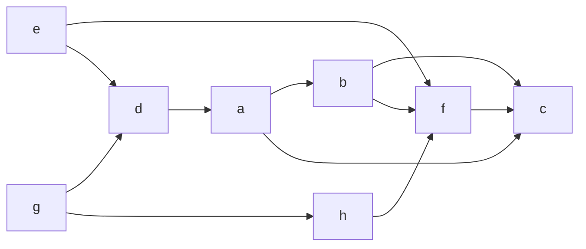

Searching a directed graph.

```mermaid
graph LR
  e --> f
  a --> b
  a --> c
  b --> c
  b --> f
  d --> a
  f --> c
  g --> d
  g --> h
  e --> d
  h --> f
```

[algorithm source](https://www.cse.unsw.edu.au/~billw/cs9414/notes/prolog/path-trace.html) 
